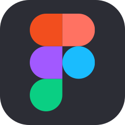
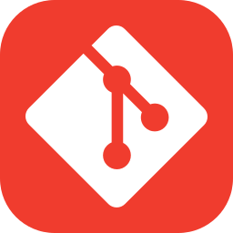
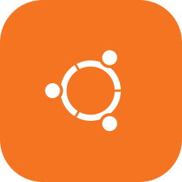

<!-- Banner-->

<!-- Who I'm-->
<picture>
  <source media="(prefers-color-scheme: dark)" srcset="./assets/text/title-dark.svg">
  <source media="(prefers-color-scheme: light)" srcset="./assets/text/title-light.svg">
  
</picture>

<!-- About me-->

  Experienced IT and developers in enterprise-level digital transformation. I build server infrastructure from scratch, configure automated scheduled backups, manage internal file sharing, monitor network devices, and install proxy servers to enhance website security. I also develop ERP/EIS systems for factory using modern web technologies.

<!-- Education -->

  Bachelor of Science in Information Technology, Silpakorn University (2021-2025) | GPA 3.06. Focuses on the development and application of software at the enterprise level, with a basic understanding of business context.

<!-- Gift -->
<picture>
  <source media="(max-width: 480px)" srcset="./assets/gif/bird.gif">
  
</picture>

<!-- Technologies -->
<picture>
  <source media="(prefers-color-scheme: dark)" srcset="./assets/text/technologies-dark.svg">
  <source media="(prefers-color-scheme: light)" srcset="./assets/text/technologies-light.svg">
  
</picture>

<!-- Icons :) Thank https://github.com/tandpfun/skill-icons.git -->

  
  &nbsp;&nbsp;&nbsp;
  
  &nbsp;&nbsp;&nbsp;
  
  &nbsp;&nbsp;&nbsp;
  
  &nbsp;&nbsp;&nbsp;
  
  &nbsp;&nbsp;&nbsp;
  
  &nbsp;&nbsp;&nbsp;
  
  &nbsp;&nbsp;&nbsp;
  
  &nbsp;&nbsp;&nbsp;
  
  &nbsp;&nbsp;&nbsp;
  

<!-- Experience -->
<h1>Exprience</h1>

<!-- 2025 - 2026 -->
<h3>IT & Developer | Nozomi Enterprise (Thailand) Co., Ltd. | 2025 - Present</h3>
<ul>
  <li>
    Lead digital transformation by converting traditional workflows to a centralised digital system to enhance operational efficiency significantly.
  </li>
  <li>
    Build and manage server infrastructure from scratch, configure automated backups, manage on-premises file sharing, enable real-time network device monitoring, and install proxy servers to enhance security and control website access.
  </li>
  <li>
    Develop and design ERP and EIS systems for factories using modern web technologies to support data-driven decision-making.
  </li>
</ul>

 

<!-- Links -->

  
  &nbsp;
  

