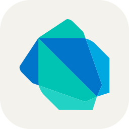
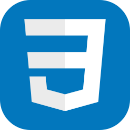
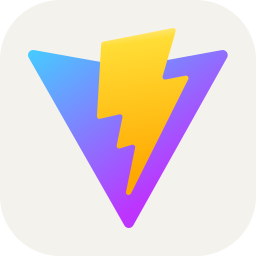
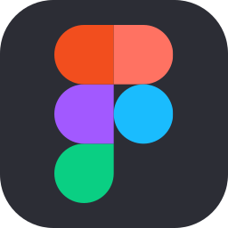
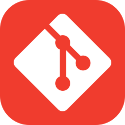

<!-- Banner-->

<!-- Title-->
<picture>
  <source media="(prefers-color-scheme: dark)" srcset="./assets/title-dark.svg">
  <source media="(prefers-color-scheme: light)" srcset="./assets/title-light.svg">
  
</picture>

<!-- About me-->

  Recent graduate in Information Technology with a foundation in both web and mobile application development. Proficient in building web applications using React Vite and creating cross-platform mobile apps with Flutter, as demonstrated in my thesis project. I'm also skilled in UI/UX design using Figma and adept at version control with Git.

  Bachelor of Science in Information Technology Silpakorn University (2021-2025) | GPA 3.06 Specializing in Software Development, Algorithms, Databases, and Modern Web Technologies

 

<!-- Button link -->

  
  &nbsp;
  

 

<!-- Technologies -->
<picture>
  <source media="(prefers-color-scheme: dark)" srcset="./assets/technologies-dark.svg">
  <source media="(prefers-color-scheme: light)" srcset="./assets/technologies-light.svg">
  
</picture>

<!-- Languages -->

  
  &nbsp;&nbsp;&nbsp;
  
  &nbsp;&nbsp;&nbsp;
  
  &nbsp;&nbsp;&nbsp;
  
  &nbsp;&nbsp;&nbsp;
  

<!-- Frameworks & Libraries -->

  
  &nbsp;&nbsp;&nbsp;
  
  &nbsp;&nbsp;&nbsp;
  
  &nbsp;&nbsp;&nbsp;
  
  &nbsp;&nbsp;&nbsp;
  

<!-- Databases -->

  
  &nbsp;&nbsp;&nbsp;
  
  &nbsp;&nbsp;&nbsp;
  
  &nbsp;&nbsp;&nbsp;
  
  &nbsp;&nbsp;&nbsp;
  

<!-- Tools -->

  
  &nbsp;&nbsp;&nbsp;
  
  &nbsp;&nbsp;&nbsp;
  

<!-- Icons source: https://skillicons.dev -->
