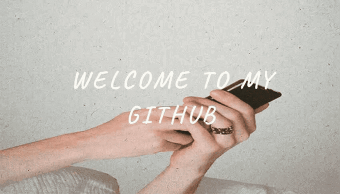
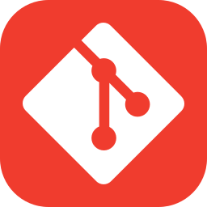

<!-- Banner -->

<!-- Gift -->
<picture>
  <source media="(max-width: 480px)" srcset="./assets/gif/bird.gif">
  
</picture>

<!-- About Me -->
<h1>About Me</h1>

  I'm more interested in how systems fit together than in the code itself. Most of what I build are web interfaces that make infrastructure easier to manage and operate.

<!-- Icons :) Thank https://github.com/tandpfun/skill-icons.git -->

  
  &nbsp;&nbsp;&nbsp;
  
  &nbsp;&nbsp;&nbsp;
  
  &nbsp;&nbsp;&nbsp;
  
  &nbsp;&nbsp;&nbsp;
  
  &nbsp;&nbsp;&nbsp;
  
  &nbsp;&nbsp;&nbsp;
  

